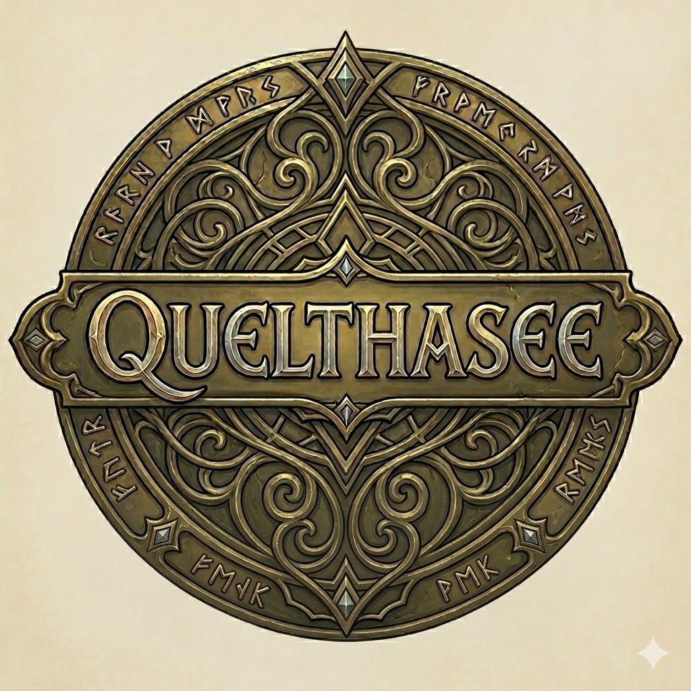

# Quelthasee — Discord RPG Bot



Tekstowa gra RPG na Discordzie napisana w TypeScript. Walka rundowa, ekspedycje, bossowie, dungeony, party, crafting, NPC z dialogami i sklepy w prywatnych wątkach. Slash commands z autocomplete + klasyczne komendy `.message-style`.

## Quick start

```bash
# 1. Klonuj i zainstaluj zależności
git clone <repo> && cd discord-bot
bun install   # lub npm install

# 2. Konfiguracja
cp .env.example .env   # uzupełnij DISCORD_TOKEN itd.

# 3. Uruchom
bun start              # bun (zalecane)
npm run start:node     # node (z dist/)
npm run dev            # watch mode
```

## Konfiguracja (`.env`)

```env
DISCORD_TOKEN=<bot_token>
DISCORD_GUILD_ID=<server_id>     # opcjonalnie — instant slash registration; bez tego: globalnie (~1h propagacji)
OLLAMA_MODEL=qwen2.5:7b           # model dla .ask (jeśli używasz Ollama)
TMDB_API_KEY=<key>                # opcjonalnie — dla .ask-movie / movie-of-the-day
THREAD_TTL_MIN=60                 # auto-cleanup nieaktywnych wątków
AMBUSH_CHECK_INTERVAL_MS=300000   # 5 min — częstotliwość losowania ambush
AMBUSH_CHANCE=0.25                # 25% szansy na ambush per check
```

## Bot invite

Bot wymaga scope **`bot` ORAZ `applications.commands`** żeby slash commands działały. W [Discord Developer Portal](https://discord.com/developers/applications) → twoja aplikacja → OAuth2 → URL Generator:
- **Scopes:** `bot` + `applications.commands`
- **Bot Permissions:** Send Messages, Manage Threads, Read Message History, Use Application Commands, Add Reactions

## Komendy

Wszystkie komendy działają w obu wariantach: **`/slash`** (ephemeral, tylko widoczne dla wywołującego, z autocomplete) i **`.message`** (publiczne).

### Główne menu

| Slash | Message | Opis |
| --- | --- | --- |
| `/menu` | `.menu` | Hub gry — buttony do wszystkich systemów |

### Postać

| Slash | Message | Opis |
| --- | --- | --- |
| `/stats [user]` | `.stats [@user]` | Profil gracza (PvP lvl, atrybuty, ekwipunek, efektywne staty z bazą crit 15%) |
| `/skills show` / `/skills add attr points` | `.skills` / `.skills add <attr> <ile>` | Primary stats: STR/AGI/WIT/INT |
| `/race list/info/pick/reset` | `.race ...` | Rasy (z autocomplete na id) |
| `/class list/info/pick/subclass/subclass2/reset` | `.class ...` | Klasy + tier-1 (lvl 20) + tier-2 (lvl 40), filtrowany autocomplete |
| `/equip uid` | `.equip <uid>` | Zakładanie itemu (autocomplete z plecaka) |
| `/unequip slot` | `.unequip <slot>` | Zdjęcie ze slotu (weapon/armor/tool) |

### Plecak i handel

| Slash | Message | Opis |
| --- | --- | --- |
| `/inv` | `.inv` | Plecak w prywatnym wątku — toggle Załóż/Zdejmij + Sprzedaj per item |
| `/city list/info/shop/buy/sell` | `.city ...` | Miasta + handlarze; `shop` otwiera prywatny wątek z buttonami |

### Gathering (zbieractwo)

| Slash | Message | Opis |
| --- | --- | --- |
| `/mine` | `.mine` | Wymaga kilofa w plecaku (nie trzeba zakładać). Cooldown 60s |
| `/fish` | `.fish` | Wymaga wędki |
| `/chop` | `.chop` | Wymaga siekiery |
| `/craft` | `.craft` / `.craft <id>` | Browser craftingu z paginacją |

### Walka

| Slash | Message | Opis |
| --- | --- | --- |
| `/expedition` | `.expedition` | Browser wypraw (4 regiony × 5 tierów); ambushe podczas wyprawy |
| `/boss` | `.boss <id>` | Walka z bossem PvE w wątku (8 bossów) |
| `/dungeon id` | `.dungeon <id>` | Multi-encounter dungeon (cooldown 30 min) |
| `/duel user` | `.duel @user` | Pojedynek PvP rundowy (1v1 lub party-vs-party przez `.duel`) |

### Społeczność

| Slash | Message | Opis |
| --- | --- | --- |
| `/party status/create/invite/accept/decline/leave/kick/disband` | `.party ...` | Drużyna do wypraw i party-duelów (max ~5 osób) |
| `/talk list` / `/talk start npc` | `.talk` / `.talk <npc>` | Rozmowy z NPC (Stary Marek w Porcie Cykada) |

### Inne (chat / admin)

| Komenda | Opis |
| --- | --- |
| `.ask <pytanie>` | Asystent (Ollama) — luźna rozmowa, kontekst per wątek |
| `.ask-movie`, `.ask-med`, `.movie-of-the-day` | Tematyczne presety |
| `.help` | Lista komend |
| `.clear`, `.purge` | Admin: czyszczenie wiadomości |

## Systemy gry

### Combat

- **Akcje per runda:** Atak / Obrona / Skill / Item — wybierane via ephemeral panel po kliknięciu "🎮 Otwórz panel"
- **Stats efektywne:** baza crit 15% + AGI×0.5 + atrybut crit + ekwipunek (weapon/armor/tool — wszystkie wliczają do dmg/def/HP/crit)
- **Mikstury:** tylko z plecaka (gracze); AI/bossy mają własne pule
- **Dodge 15%, block 75%** (przy obronie), **crit ×2 dmg**
- **Skille klas** z cooldownami, buffy/debuffy (DoT, HoT, shield, taunt, paraliż)

### Wątki

- **Battle threads** (boss/duel/dungeon/ambush) — publiczne, podsumowanie idzie na parent channel, archiwizacja + delete za 120s
- **Shop / inventory threads** — prywatne, ✖ Zamknij usuwa od razu
- Idle timeout 5 min dla shop/inventory

### Regiony i ekspedycje

- 4 regiony × 5 tierów = 15 ekspedycji
- Region wymaga combat lvl: R1=1, R2=8, R3=16, R4=24
- Ekspedycja T2+ wymaga `(tier-1)*8` combat lvl
- Ambush co 5 min z 25% szansą — moby tier-aware do combat lvl gracza

### NPC i dialogi

- Stateless graf dialogowy (`startNodeId` + `nodes: Record<id, node>`)
- Każdy NPC ma `dialog: Dialog` z opcjami `{label, goto}` (`'end'` kończy)
- Pliki w `src/modules/game/npcs/{cityId}/{npc}.npc.ts`

## Architektura

```
src/
├── commands/                  Komendy chat (Ollama-based: ask, movie, etc.)
├── managers/                  CommandManager (dispatch, slash registration)
├── modules/game/
│   ├── cities/                Miasta + handlarze (Port Cikada, Oakhaven, Krasnoludzka Twierdza, Czarna Cytadela)
│   ├── classes/               Klasy + subklasy (tier-1 i tier-2)
│   ├── races/                 Rasy
│   ├── mobs/                  Boss-moby (8) + ambush-moby (10) z tier-multiplier
│   ├── npcs/                  NPC z dialogami (grouped per cityId)
│   ├── skills/                Skille klas (35+) z apply/cooldown
│   ├── engine/                Combat-battle, AI, buffy, ambush loop
│   ├── ui/                    Builder buttonów (battle, shop, menu, expedition, craft, boss, city, dialog)
│   ├── services/              Stan + logika: stats, party, expedition, boss, dungeon, duel, city, craft, inventory, dialog, menu
│   ├── commands/              Cienkie access-pointy (parsują args, delegują do services)
│   └── index.ts               registerGameCommands — DI wiring
├── types/                     ICommand + ISlashCommand interfejsy
├── ollama.ts                  Streaming Ollama API
├── tools.ts                   Function-calling tools (TMDB, etc.)
└── index.ts                   Bot bootstrap, slash registration on ready
```

**Konwencje** (utrwalone w pamięci między sesjami):
- **Komendy = cienkie access-pointy** — logika w `*.service.ts`, komendy tylko parsują args
- **No `as` casts** — proper typing / type guards / generics zamiast
- **Effective stats SoT** — `PlayerStatsService.effective*()` jako single source of truth dla UI i `buildPlayerCombatant`

## Development

```bash
npm run typecheck     # tsc --noEmit
npm run lint          # ESLint
npm run lint:fix      # auto-fix
npm test              # Jest (260+ testów)
npm run format        # Prettier
npm run build         # tsc → dist/
```

**Tests:** unit (`test/unit/`) i feature (`test/feature/`) — kombinują real PlayerStatsService z fake interaction objects, sprawdzają cały flow buttonów i slash commands.

## Tech stack

- **Runtime:** Bun (preferred) lub Node 18+
- **Discord:** discord.js 14 (slash commands, buttons, threads, autocomplete)
- **AI chat:** Ollama (qwen2.5:7b default) — opcjonalne dla `.ask`
- **TS:** TypeScript 6, strict mode, ESM-only
- **Test:** Jest + ts-jest
- **Lint:** ESLint 9 + typescript-eslint, Prettier

## Versioning

Tagi semver per release. Aktualnie `v1.7.0` (sell items from inventory). Pełna historia w `git log`.
